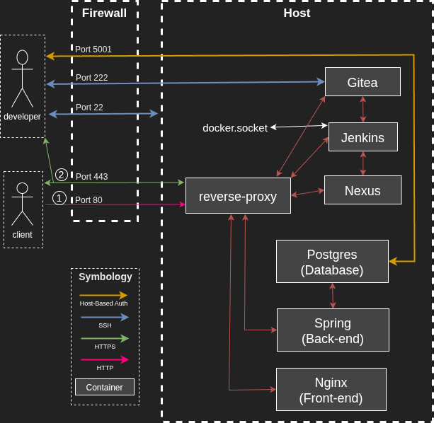
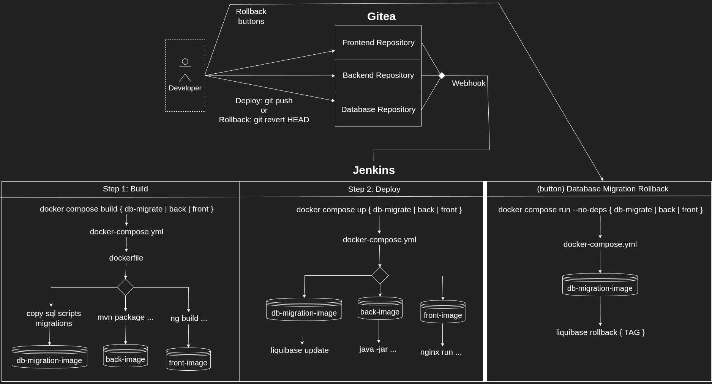
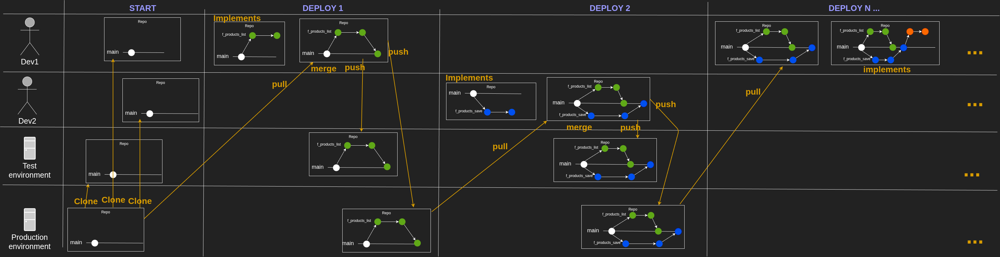
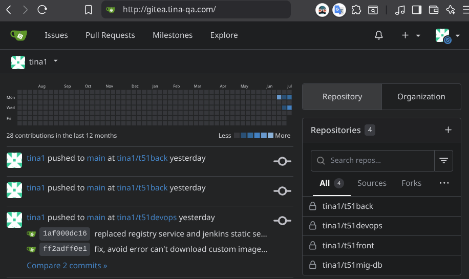
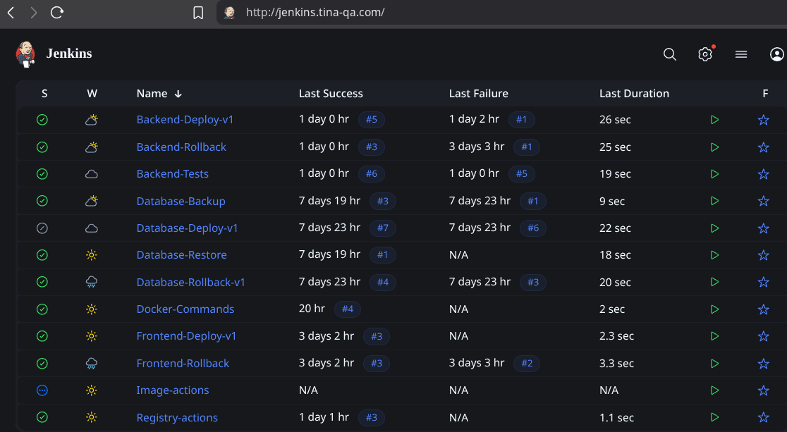
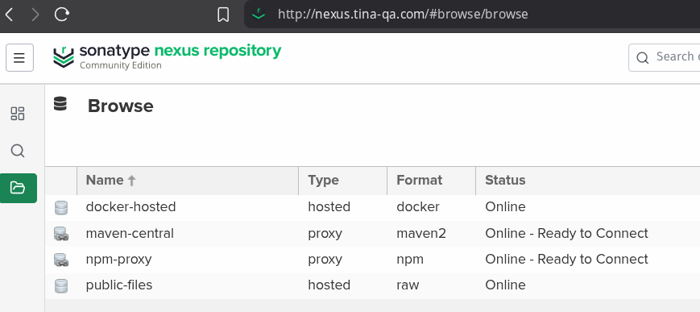
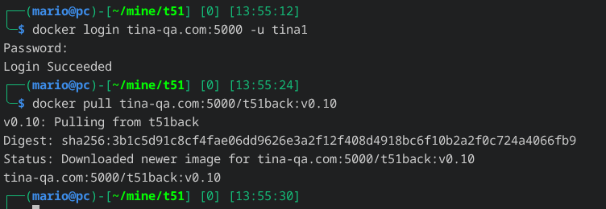
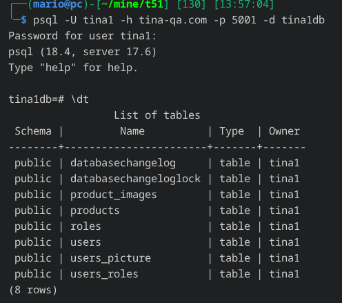
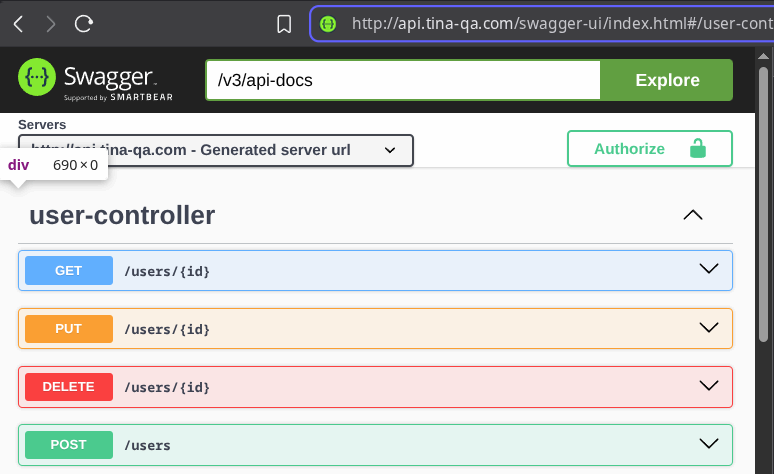
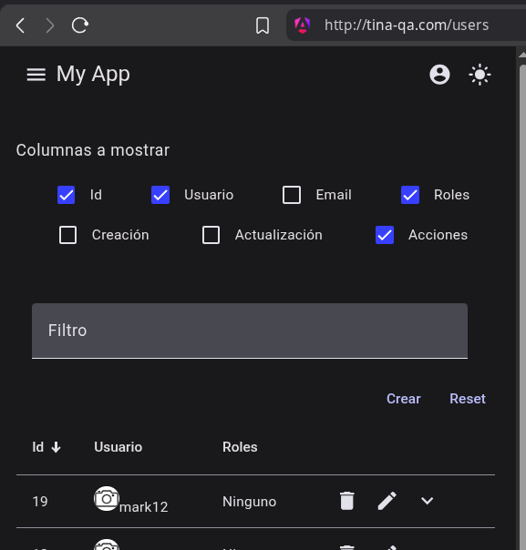

# T51

- [T51](#t51)
  - [Introduction](#introduction)
  - [Overall features](#overall-features)
  - [Installation](#installation)
    - [Requirements](#requirements)
    - [Setup server services.](#setup-server-services)
    - [Setup a Developer machine](#setup-a-developer-machine)
  - [Guides](#guides)


## Introduction

T51 is a portable ready-to-use, self-hosted, and open-source DevOps project,
which can be installed with just one command, either with or without internet,
which can work as a productive single host environment, or an acceptance stage
environment to select release docker images candidates, and publish them in a
docker registry. The project is composed of the following sub-projects.

1. DevOps: Docker, Jenkins, Gitea, Nexus and Nginx as a reverse-proxy.
2. Database: Postgres and Liquibase for a Evolutionary Database Design.
3. Backend: A RESFul service using Spring boot with Hexagonal architecture.
4. Frontend: Angular with a modularity through components.

For example, we have pre-builded deploy and rollback pipelines for Database,
Backend and Frontend, that are automatically triggered when we push to
repository in Gitea, and other similar pipelines.

## Overall features

Here resume of the setup from the services and their connections perspective.



Here a resume of the pipelines workflow perspective.



Here is a proposed workflow using github flow strategy.




<!--

■■■■■■■■■■■■■■■■■■■■■■■■■■■■■■■■■■■■■■■■■■■■■■■■■■■■■■■■■■■■■■■■■■■■■■■■■■■■■■■■

-->

----

<!--

■■■■■■■■■■■■■■■■■■■■■■■■■■■■■■■■■■■■■■■■■■■■■■■■■■■■■■■■■■■■■■■■■■■■■■■■■■■■■■■■

-->

## Installation

We have two different parts here, set up the server and set up the developer
machine. For more details of for example, how to install **without internet**
and setup docker, please see, [this file](./docs/howTo1_InstallOnServer.md), but
in resume, we just need the following steps in a host with docker compose
installed.

### Requirements

- 4GB RAM.
- 15GB free hard drive.
- Any linux that passes the `setup/install_functions.sh -> check_dependencies` function
  - Tested in Ubuntu Server 24.04 and Arch Linux.
- Docker Compose with rootless access.

### Setup server services.

```shell
git clone https://github.com/somsos/DevOps-Template-51 /my-project
> bash ./install.sh
# interaction example:
# Enter the environment (local, test, qa, stage, PROD): test
# Enter the domain (e.g., 'example.com', 'example1-test.com'): example1-test.com
# Enter the App username: user1
# Enter the App password (more than 8 letters): user1-pass1
# Repeat the App password: user1-pass1
# Enter the App email: user1@gmail.com
# Enter the shared token: example1-token
# Enter the database schema name: example1db
# ... Omitted logs of installation to keep it short ...
# Available Services all have the same credentials asked for the install.sh script .
# Gitea     http://gitea.example1-test.com
# Jenkins   http://jenkins.example1-test.com
# Nexus     http://nexus.example1-test.com
# Backend   http://api.example1-test.com/swagger-ui/index.html
# Frontend  http://example1-test.com
# Registry  http://registry.example1-test.com
# Database  psql postgresql://user1:<DB_PASS>@example1-test.com:5001/example_db
```

Here some captures of the services of the setup, all off them use the same user
and password introduced in the `install.sh` script input, the script saves this
credentials in the `.env` file.

Gitea:  


Jenkins:  


Nexus:  


Docker registry:  


App Postgres Database:  


App Backend Swagger:  


App Angular:  


### Setup a Developer machine

Gitea is using a ssh public-private keys as authentication process, so:

- If we are using the same machine to host the DevOps services and develop, this
  is not necessary.

- But If we are using different machines, one for the DevOps services and
  another to develop, we need to import the private key, to be able to clone and
  push changes to the Gitea repositories, so the pipelines would be triggered
  automatically on a git push.

```shell
scp -r -P22 my-user@example1-test.com:/my-project/setup/secrets/ssh_key.priv ~/.ssh/t51key.priv

cat >> ~/.ssh/config <<EOF

Host gitea.example1-test.com
    HostName gitea.example1-test.com
    Port 222
    User git
    IdentityFile ~/.ssh/t51key.priv

EOF
```

Now we should be able to auth to the Gitea service.

```shell
ssh -T git@gitea.example1-test.com
# OUTPUT: Hi there, XXXXX You've successfully authenticated ...
```

Now we can clone the repositories

```shell
git clone ssh://git@gitea.example1-test.com:222/user1/t51devops.git ~/my-project

git clone ssh://git@gitea.example1-test.com:222/user1/t51mig-db.git ~/my-project/app/db/source

git clone ssh://git@gitea.example1-test.com:222/user1/t51back.git ~/my-project/app/back/source

git clone ssh://git@gitea.example1-test.com:222/user1/t51front.git ~/my-project/app/front/source
```

<!--

■■■■■■■■■■■■■■■■■■■■■■■■■■■■■■■■■■■■■■■■■■■■■■■■■■■■■■■■■■■■■■■■■■■■■■■■■■■■■■■■

-->

----

<!--

■■■■■■■■■■■■■■■■■■■■■■■■■■■■■■■■■■■■■■■■■■■■■■■■■■■■■■■■■■■■■■■■■■■■■■■■■■■■■■■■

-->

## Guides

For more details about how to install and make the necessary set ups, so we have
an developing workflow working, I have the following guides where I explain the
necessary details.

- [How to install project on a remote host](./docs/howTo1_InstallProjectOnARemoteHost.md)
- [How to setup a developer machine](./docs/howTo2_setupADeveloperMachine.md)
- [How to deploy or rollback some app layer](./docs/howTo3_DeployOrRollback.md)
- [How to understand the whole project](./docs/howTo4_UnderstandTheWholeProject.md)
- [How to develop database](./docs/howTo5_DevelopDatabase.md)
- [How to develop backend](./docs/howTo6_DevelopBackend.md)
- [How to develop frontend](./docs/howTo7_DevelopFrontend.md)
- [How to develop devops](./docs/howTo8_DevelopDevOps.md)
- [How to have multiple environments](./docs/howTo9_haveMultipleEnvironments.md)
