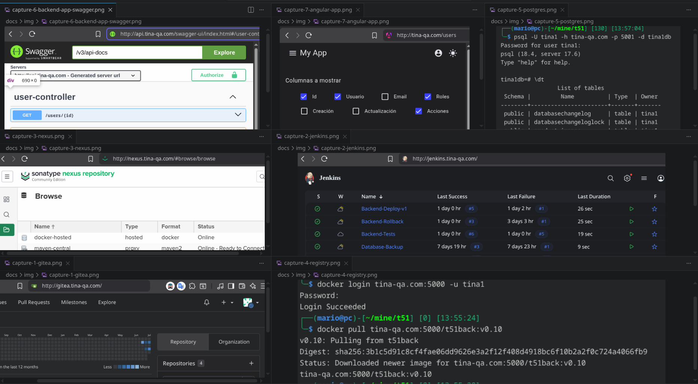

# DevOps-Template-51: (Prebuilt, Self-hostable Application With A PaaS Setup)

This is a ready to start to develop application, with preconfigured deploy and
rollback pipelines in Jenkins, for the stack SpringBoot3, Angular18, and
Postgres17. Easy to install and offline mode.



- [DevOps-Template-51: (Prebuilt, Self-hostable Application With A PaaS Setup)](#devops-template-51-prebuilt-self-hostable-application-with-a-paas-setup)
  - [Installation](#installation)
    - [Requirements](#requirements)
    - [Setup server services.](#setup-server-services)
    - [Setup a Developer machine](#setup-a-developer-machine)
  - [Guides](#guides)


## Installation

We have two different parts here, set up the server that runs the pipelines, and
set up the developer machine that is going to download the code and push the
changes.

For more details of for example, how to install **without internet**, install
rootless docker, etc, please see [this document](./docs/howTo1_InstallOnServer.md),
but overall, we just need to follow the next steps in a host with Linux and
docker compose installed.

### Requirements

- 4GB RAM (Nexus consumes 2GB).
- 15GB free hard drive.
- Linux (Tested on Ubuntu Server 24.04 and an Arch Linux sub-distro).
- Docker compose with rootless access.

<!-- 

%%%%%%%%%%%%%%%%%%%%%%%

%%%%%%%%%%%%%%%%%%%%%%%

%%%%%%%%%%%%%%%%%%%%%%%

-->

----

<!-- 

%%%%%%%%%%%%%%%%%%%%%%%

%%%%%%%%%%%%%%%%%%%%%%%

%%%%%%%%%%%%%%%%%%%%%%%

-->

### Setup server services.

```shell
git clone https://github.com/somsos/DevOps-Template-51 ~/my-project
cd ~/my-project
bash ./install.sh
# Enter the environment (local, test, qa, stage, PROD): test
# Enter the domain (e.g., 'example.com', 'example1-test.com'): example1-test.com
# Enter the App username: myUser
# Enter the App password (more than 8 letters): myPassword
# Repeat the App password: myPassword
# [INFO] Created ...
```

The services that are installed are the following ones. All off them use the
**same credential** introduced in the `install.sh` which are saved in the `.env`
file.

```yml
Gitea:    http://gitea.example1-test.com
Jenkins:  http://jenkins.example1-test.com
Nexus:    http://nexus.example1-test.com
Backend:  http://api.example1-test.com/swagger-ui/index.html
Frontend: http://example1-test.com
Database: psql postgresql://myUser:myPassword@$example1-test.com:5001/myUser1db
Docker-Registry: http://registry.example1-test.com
```


### Setup a Developer machine

Gitea is using a ssh public-private keys as authentication process, so:

- If we are using the same machine to host the DevOps services and develop, this
  is not necessary.

- But If we are using different machines, one for the DevOps services and
  another to develop, we need to import the private key, to be able to clone and
  push changes to the Gitea repositories, so the pipelines would be triggered
  automatically on a git push.

```shell
scp -r -P22 myUser@example1-test.com:/my-project/setup/secrets/ssh_key.priv ~/.ssh/t51key.priv

cat >> ~/.ssh/config <<EOF

Host gitea.example1-test.com
    HostName gitea.example1-test.com
    Port 222
    User git
    IdentityFile ~/.ssh/t51key.priv

EOF
```

Now we should be able to authenticate to the Gitea service.

```shell
ssh -T git@gitea.example1-test.com
# OUTPUT: Hi there, XXXXX You've successfully authenticated ...
```

Now we can clone the repositories

```shell
git clone ssh://git@gitea.example1-test.com:222/myUser/t51devops.git ~/my-project

git clone ssh://git@gitea.example1-test.com:222/myUser/t51mig-db.git ~/my-project/app/db/source

git clone ssh://git@gitea.example1-test.com:222/myUser/t51back.git ~/my-project/app/back/source

git clone ssh://git@gitea.example1-test.com:222/myUser/t51front.git ~/my-project/app/front/source
```

<!--

■■■■■■■■■■■■■■■■■■■■■■■■■■■■■■■■■■■■■■■■■■■■■■■■■■■■■■■■■■■■■■■■■■■■■■■■■■■■■■■■

-->

----

<!--

■■■■■■■■■■■■■■■■■■■■■■■■■■■■■■■■■■■■■■■■■■■■■■■■■■■■■■■■■■■■■■■■■■■■■■■■■■■■■■■■

-->

## Guides

For more details about how to install and make the necessary set ups, so we have
an developing workflow working, I have the following guides where I explain the
necessary details.

- [How to install project on a remote host](./docs/1intro_howToInstallProjectOnARemoteHost.md)
- [How to setup a developer machine](./docs/howTo2_setupADeveloperMachine.md)
- [How to deploy or rollback some app layer](./docs/howTo3_DeployOrRollback.md)
- [How to understand the whole project](./docs/howTo4_UnderstandTheWholeProject.md)
- [How to develop database](./docs/howTo5_DevelopDatabase.md)
- [How to develop backend](./docs/howTo6_DevelopBackend.md)
- [How to develop frontend](./docs/howTo7_DevelopFrontend.md)
- [How to develop devops](./docs/howTo8_DevelopDevOps.md)
- [How to have multiple environments](./docs/howTo9_haveMultipleEnvironments.md)
