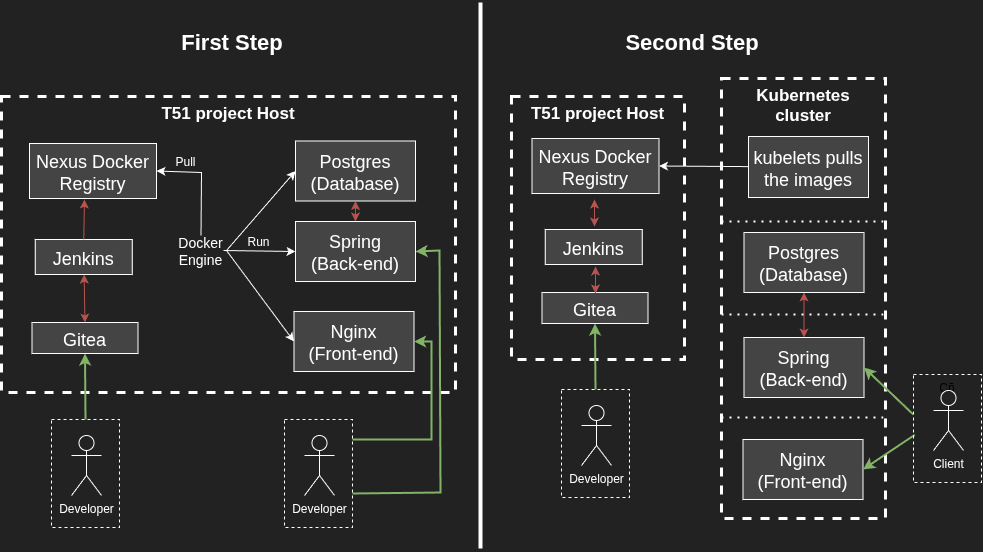
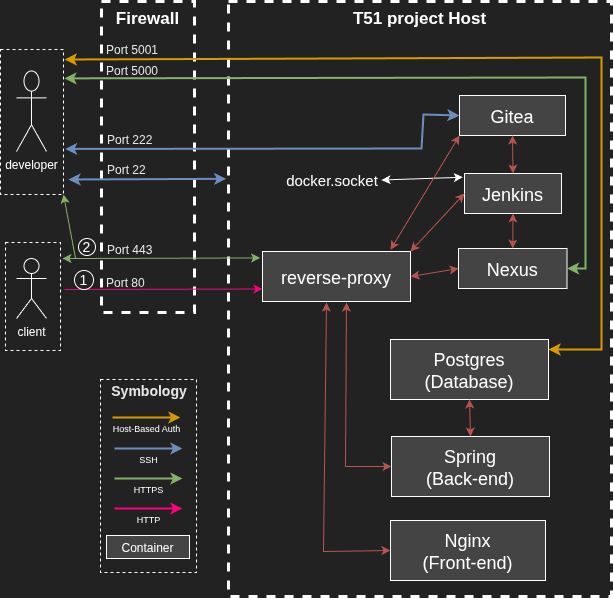
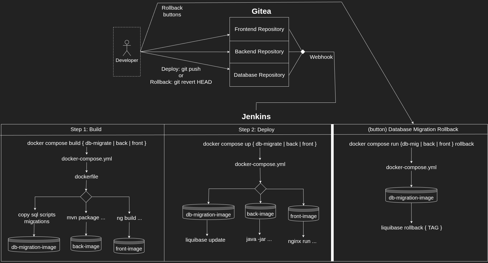
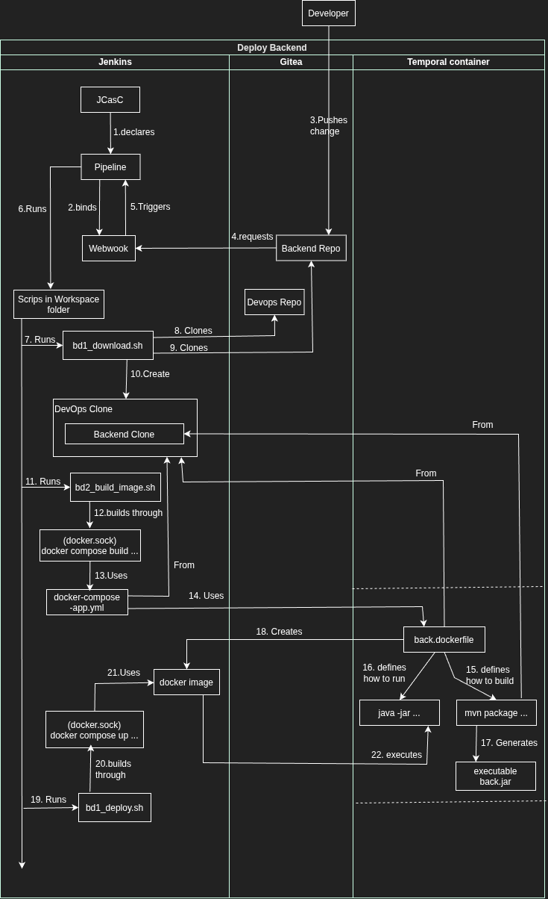
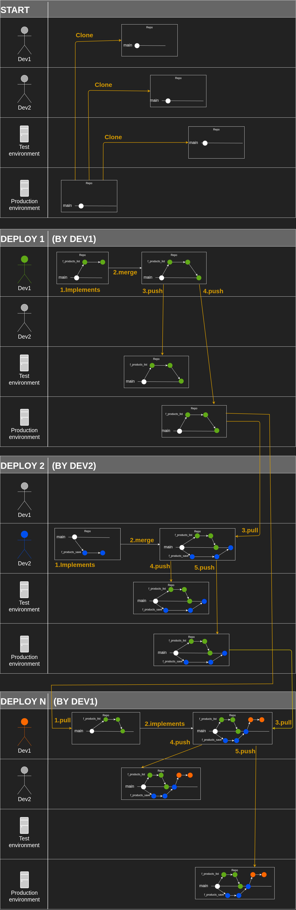

# How to Understand The Whole Project

- [How to Understand The Whole Project](#how-to-understand-the-whole-project)
  - [Resume](#resume)
    - [Overall features](#overall-features)
  - [Terminology](#terminology)
  - [The general idea](#the-general-idea)
  - [folder-file-naming conventions](#folder-file-naming-conventions)
  - [Folder structure capture list description](#folder-structure-capture-list-description)

## Resume

T51 is a portable, ready-to-use, self-hosted, either with or without internet
one command installation, and open-source DevOps project, which can work as a
productive single host environment, or an acceptance stage environment to build
and select production docker images candidates, to publish them in a docker
registry, as part of a Kubernetes setup. It can be seen here that the project
is planned to give a second step, I remove some elements in the graph of bellow
to keep it simple.



The project is composed of the following sub-projects.

1. Essentials: Docker compose, Nginx as a reverse-proxy.
2. DevOps: Jenkins, Gitea, Nexus.
3. Database: Postgres and Liquibase for a Evolutionary Database Design.
4. Backend: A RESFul service using Spring boot with Hexagonal architecture.
5. Frontend: Angular with a modularity through components.

Here a little more detailed inter-connections the setup has, so the different
tools can work together.



For example, we have pre-builded deploy and rollback pipelines for Database,
Backend and Frontend, that are automatically triggered when we push to
repository in Gitea, and other similar pipelines.

### Overall features

Resume of the available pipelines, between them are:
- Deploy and Rollback Backend
- Deploy and Rollback Frontend
- Deploy and Rollback Database Migration.  




An example of how the deploy-backend pipeline works, other pipelines have a
similar flow.



Proposed workflow using github flow strategy.



## Terminology

First, the project is not trying to invent anything new, it just apply already
well known concepts and tools, Here is a list of these applied terms.

- `DevOps`: It's a methodology and philosophy that combines software
  development (Dev) and IT operations (Ops) to accelerate delivery. It breaks
  down traditional silos between teams, fostering a culture of shared
  responsibility, communication, and automation throughout the entire
  application lifecycle.

- `CasC and IasC`: (Configuration as Code and Infrastructure as Code) these
  methodologies describe the configuration of a resource, tool, service, system,
  or infrastructure in a code format, allowing it to be stored, versioned, and
  processed similarly to application code.

- `Deterministic`: Predictable results overtime, reduce dependencies that one
  can't control, achieve repeatability via version control and cold start up.

- `Cold start`: This occurs when a new instance (e.g, server, container, or
  function) is initialized from scratch, incurring full initialization overhead
  and resulting in higher latency, but tests repeatability and portability.

- `Warm start`: Reusing an already initialized and cached instance, which allows
  for significantly faster response times because code, dependencies, and
  connections are already loaded, but is easier to make bad assumptions, like
  building on an unregistered change. 

- `Anti-branching` Continuous Integration was invented as an antidote to the
  complexities caused by branching, because the main objective of a branch is to
  hide details and isolate a change from others changes, so I prefer a strategy
  of a single `Trunk/Master branch` and make small changes and continuously
  evaluate them,

- `Evolutionary Database Design` based on this article
  [evoDB](https://martinfowler.com/articles/evodb.html), this methodology allows
  a database design to evolve, and being versioned as an application develops
  important capabilities for agile methodologies as DevOps and CasC philosophy.

- `Decouple how it's built and how it's run`: In the case of this project, it's
  proposed to have 2 parts, a unique server docker setup to build, test and
  select the release docker images candidates, and a multi-server Kubernetes
  setup to deploy the selected production candidates, but this last part it's
  outside of the scope of this project.

- `Developing Environments`: These ones include necessary developer tools, like
  automated tests, compilers, detailed logging, etc.

- `Running Environments` Production can fit in this category, which we just
  include the necessary tools to run the application


## The general idea

A main part of the project are the repositories, because they are taken as the
central state of the project, whatever is in the main branch of the repository,
is what is deployed, so when we push a commit, it happens a deploy, or if we
need a rollback, we apply a git revert or we start a pipeline to delete the last
pushed commit.

A pipeline follows the next execution path, to explain it I will use the Backend
deploy.

**1. Jenkins UI:** Using the JCasC it's declared a pipeline, which just binds a
webhook with the necessary scripts, in the workspace directory.

```bash
pipelineJob('Backend-Deploy')
  # URL that triggers the pipeline looks like this:
  # http://jenkins/generic-webhook-trigger/invoke?token=t51back-deploy
  triggers ... genericTrigger ... token("t51back-deploy")
  stages {
    stage('1/3: Download') ... 1bd-download.sh
    stage('2/3: Build image') ... 2bd-build-image.sh
    stage('3/3: Deploy') ... 3bd-deploy.sh
```

**2. Gitea repository and workspace directory:** To be easy to test the scripts
used in the jenkins pipelines, I have them in a bound volume, so I can run them
in the shell either of docker host or the jenkins container.

```bash
# Download from repository
git clone --branch main ssh:.../t51devops.git  /t51
git clone --branch main ssh:...../t51back.git  /t51/app/back/source

# Build
# At this point we already downloaded all the dependencies, as compose.yml,
# dockerfile, Java source code, etc.
docker compose build back
#   


# Deploy
docker compose up -d  back

# Check start
MESSAGE_BACK_STARTED="Started AdapterApplication in"
MESSAGE_BACK_FAILED_1="Application run failed"
while read line; do
  if $line ~= $MESSAGE_BACK_STARTED;  echo "Success"; return 0; end
  if $line ~= $MESSAGE_BACK_FAILED_1; echo "Error." ; exit 1  ; end
done < <(docker logs -f back)
```


->  -> docker.socket


1. host shell -> docker compose up back_utils unitary_tests
2. docker compose -> define configuration as ports, dockerfile, entrypoint, etc.
3. dockerfile -> defines the how to build and run the service.
4. entrypoint -> This run on the start up of the container, 
5. Service -> 


but we have two different environments, when we run it
in the docker host, and when we run it in a container. The differences are:

- localhost environment
  - We can as always in a local machine, nothing really changes, just having in
    consideration some details like spring and angular profiles, but nothing
    special.

- containerized environments
  - As I'm using a containerized setup we can use this setup on any machine
    including.
      - **localhost**: We can test our changes using the devops pipelines, which
        is recommendable because one thing is how it behaves in a developer
        machine, which can have unconsidered states, making the unitary tests
        unreliable, but if we use the pipelines we have a more consistent state
        and even the possibility to start the app from zero.
      - **stage**: 

- Container
  - When we run the docker compose command in an container, I assume is for a
    pipeline flow, so I download the code form the repository.

- Stage
  - 


## folder-file-naming conventions

- `.env` and `.env.example`: These are the main files of our app, they are the
  same, the only difference, is that `.env` is the one we load the variables,
  but it's not included in the repository, because it has sensitive data like
  users and passwords, and `.env.example` is included in the repository to keep
  track of the changes, so can be recreated easily.

- `install.sh`: The idea is that our setup can be installed as any other popular 
  application, as WhatsApp, Wordpress or Jenkins, and if our system can be
  installed with just one command, this prove that our system is portable,
  replicable because we have all the changes included in the repository.
    - `Why an offline install` Using an offline setup to set up an app which
      will live on the internet, might sound without sense.

- `docker-compose-***.yml` It has the docker infrastructure and services
  configurations, in my case I have 3 file.
    - `docker-compose.yml`: Our main configuration, where I include the other
      docker compose files, so I can have them by separated, but share common
      configurations as the network config or shared volumes.
    - `docker-compose-devops.yml`: Here is the necessary services for the
      automaton pipelines, which include Jenkins, Gitea, Nexus, etc.
    - `docker-compose-app.yml`: Here is just the necessary configuration, to run
      our app, e.g., reverse-proxy, database, backend, and Frontend.

- `***.dockerfile`: It has the necessary dependencies and configuration to
  build and run a service, e.g.:
    - `front.dockerfile`: Here I use the image `node:***-alpine***` which has
      the operative system and tooling to build the app, in this case, alpine
      and node, and in a second stage I have the image `nginx:***-alpine***`
      which declares the necessary to run the app, in this case an alpine and
      Nginx.
    - `jenkins-with-docker.dockerfile`: Here is the same idea, but here I build
      and configure the necessary, to start a Jenkins with access docker.socket
      of the docker host.

- `***.entrypoint.sh`: In the case that the service have a complex initial start
  up, so the service has a desire state, here I declare how to archive it, also
  important to notice this is executed by the container, so we have a stable
  state. e.g.
    - `gitea-entrypoint.sh`: As I wanted the service to have a determinate user
      and password, and determinate repositories ready to be cloned, using a
      determinate ssh configuration, it's a complex setup, so all this is done
      in this file.

- `app/***/source`: The source code application on developing, is saved in these
  folders, they are ignored in the repository (.gitignore), because each one has
  its own repository, so we can distinguish which layer needs to be deployed or
  rollbacked.
    - `app/db/source`: It's the source code of the database, in this case, it's
      being used a [Martin Fowler](https://martinfowler.com/articles/evodb.html).
    - `app/back/source`: It's the source code for the backend, in this case, an
      Restful JSON API using Spring framework.
    - `app/front/source`: It's the source code of the frontend, in this case an 
      Angular app.

- `setup/***`: The services configuration and data are saved in these folders,
  as a CasC philosophy is being followed, this requires of several files, each
  one defining a specific part, as are the `.dockerfile` and `entrypoint` files
  e.g..
    - `jenkins/casc/`: Jenkins has it's own CasC plugin, so the required files
      are saved here.
    - `jenkins/vol-jenkins_home/`: I prefer the `bind mounts`, at least for
      creating the setup, it makes easier some tasks, but I think there would
      not be a problem to pass them to named volumes.

- `workspace/`: This could have called pipelines as well, because I save the
  necessary files to create the pipelines, and to be easy to develop them, these
  executables can be executed at host level or container level, of course, in
  the pipelines they will be run in a container to have better control over the
  state, for example.
    - `workspace/Backend-Deploy` Here are the scripts to download, build and
      deploy the necessary, it might be easier to create them using the Jenkins
      UI, but as we are following a `CasC` methodology, making them like that
      there could be unregistered changes that affect the portability.

- `vol-***/0vol-***.md`: On a just cloned repository, there are several folders
  with the prefix *vol-*, and have only one markdown file in them, these folders
  are the container-host bond volumes, and have the markdown so git create the
  folder, otherwise is created by the docker daemon which runs as root, then the
  container might not have root access and that can causes problems, so I avoid
  that problem, making that the folder is created in the repository cloning and
  not in by the docker daemon, e.g. *setup/nexus/vol-data/0vol-data.md* and
  *setup/gitea/vol-config-dir/0vol-config-dir.md*

- `***/README.md`: There are markdown files over here and there, which act like
  comments in a code, they are part of the documentation of the project, which
  explain some folder function or propose.

- `***.drawio`: Diagrams made using [drawio](https://github.com/jgraph/drawio)
  an apache2.0 license electron app, which is compatible with any browser or
  IDE with embedded web apps as VSCode. 


## Folder structure capture list description

I already explained the folder patterns and most important files, now I add a
capture of all the project files, to give a more visual explication.

```yml
*
├── app
│   ├── back # Here are all the files related to the backend app.
│   │   ├── source # The backend repository content
│   │   ├── back.dockerfile # Conf of how to build (maven) and start the app (JRE).
│   │   ├── back_utils.dockerfile # The same as "back.dock..." but just with maven for tasks as testing.
│   │   ├── back_utils.entrypoint.sh # Define how to run the tests (unitary, integration, etc.).
│   │   ├── mvn-settings.xml # We are using nexus as maven-central proxy here we configure this part.
│   │   └── README.md # Backend layer Some important and useful help for the developer.
│   ├── db # Here are all the files related to database and its migrations.
│   │   ├── source # The database-migrations repository content
│   │   ├── db_utils.dockerfile # builds a container with liquibase and a custom entrypoint.
│   │   └── db_utils.entrypoint.sh # # Define how to run the different liquibase commands.
│   ├── front # Here are all the files related to the frontend app.
│   │   ├── source # The frontend repository content
│   │   ├── front.dockerfile # defines the docker image to build and run the frontend.
│   │   └── Dockerfile-nginx.config # I needed a custom conf. so the SPA app worked properly.
│   ├── docker-compose-app.yml # it defines how to run the system as a multi-container app.
│   └── README.md # Some important and useful help for the developer.
├── dep_data # it has heavy dependencies just required if ones want to perform an offline installation, so they are not included in the repository. 
│   ├── docker_installer # necessary docker installers.
│   │   ├── containerd.io_2.2.4-1~ubuntu.24.04~noble_amd64.deb
│   │   ├── docker-buildx-plugin_0.34.1-1~ubuntu.24.04~noble_amd64.deb
│   │   ├── docker-ce_29.5.3-1~ubuntu.24.04~noble_amd64.deb
│   │   ├── docker-ce-cli_29.5.3-1~ubuntu.24.04~noble_amd64.deb
│   │   └── docker-compose-plugin_5.1.4-1~ubuntu.24.04~noble_amd64.deb
│   ├── 0dep_data.md # Useful info. for developers of this folder.
│   ├── IMAGE_CURL.tar # all the IMAGE_***.tar files are docker images, so we can load them from the filesystem and not from internet, all this images names and version are declared in the .env file.
│   ├── IMAGE_***.tar
│   └── pre_initialized_nexus_mvn_npm.tar.xz # A nexus instance with maven and node dependencies already downloaded.
├── docs # necessary files for the project documentation.
│   ├── img # images and similar files that complement the documentation.
│   ├── github-flow.drawio # Source of the diagram of the proposed GitFlow strategy.
│   ├── github-flow.png # Same but in a portable format.
│   ├── howTo***_***.md # introductory ordered documentation for developers.
│   ├── MANIFEST.md # Set of core principles which guides the developing decisions.
│   ├── pipelines-workflow.drawio # A graph of how the pipelines work.
│   ├── setup-connections.drawio # A graph of how the different services are inter-connected
│   ├── TODO.md # Personal list of pending activities.
│   ├── uninstall.md # instructions to uninstall the project from the host.
│   └── what-I-learned.md # Notes of what I'm learning on the path.
├── setup # All the related to DevOps tooling and dependencies 
│   ├── gitea
│   │   ├── initial_repos # Here I save the repos to add to Gitea on initial the install, so then a developer can clone them.
│   │   │   ├── t51back.tar.xz # backend initial repository
│   │   │   ├── t51devops.tar.xz # DevOps initial repository
│   │   │   ├── t51front.tar.xz # Frontend initial repository
│   │   │   └── t51mig-db.tar.xz # Database migrations initial repository
│   │   ├── vol-config-dir # First bound Gitea volume which has only config files.
│   │   │   ├── 0vol-config-dir.md # dummy file so git creates the folder and not the docker daemon
│   │   │   └── app.ini # Main Gitea config file.
│   │   ├── vol-data # Second bound Gitea volume which all the service files as executables.
│   │   └── gitea-entrypoint.sh # This script checks if the service has the correct state, e.g. if the repo t51back does not exists, uncompress  t51back.tar.xz and creates it.
│   ├── jenkins
│   │   ├── casc # Jenkins has it's own CasC strategy called JCasC, I just followed the Jenkins documentation.
│   │   │   ├── users.yaml # This defines the user with one authenticates with.
│   │   │   ├── plugins.txt # List of plugins to be pre-installed in Jenkins
│   │   │   ├── # Here are all the pipelines for our app, so they are created on
│   │   │   ├── # start up and we can save and version them.
│   │   │   ├── # They just are like a user interface declarator and webhook binder,
│   │   │   ├── # because all the logic is saved in bash shell scripts (.sh).
│   │   │   ├── job_backend_deploy.yaml # It calls the necessary scripts to deploy the backend
│   │   │   ├── job_Database-Backup.yaml # It calls the necessary scripts to create a database backup
│   │   │   ├── job_Frontend-Rollback.yaml # It calls the necessary scripts to rollback the frontend.
│   │   │   └──  ...
│   │   ├── jenkins-entrypoint.sh # There were a few thing I could not do using JCasC, e.g., the ssh-git configuration.
│   │   └── jenkins-with-docker.dockerfile # Defines a custom Jenkins image with docker access.
│   ├── nexus
│   │   ├── vol-data # bounded volume
│   │   ├── nexus-entrypoint.sh # Here I create the different
│   │   └── nexus-pre-initialized.tar.xz # I couldn't start a conf without the initial nexus set up it asks at the UI, so I start an instance with this volume content.
│   ├── reverse-proxy
│   │   ├── certs # In case of get a SSL/HTTPS conf the certificates are stored here.
│   │   ├── conf.d
│   │   │   └── default.conf # The Nginx main configuration, now is automatic but might be manual/static.
│   ├── secrets
│   │   ├── README_secrets.md # Dummy file so git creates the folder and not the docker daemon
│   │   ├── ssh_key.priv # ssh private key, generated on install.sh using ssh-keygen
│   │   └── ssh_key.pub # ssh public key, generated on install.sh
│   ├── shared # shared configuration between containers, in this case 2 ssh configuration files.
│   │   ├── known_hosts
│   │   └── ssh_config
│   ├── docker-compose-devops.yml # Multi-container run configuration
│   └── install_functions.sh
├── workspace # Pipelines scripts
│   ├── 0_scripts # helpers and shared functions for pipelines
│   │   ├── build_image.sh
│   │   ├── check_start.sh
│   │   ├── deploy.sh
│   │   └── ...
│   ├── 0_static
│   │   ├── badge_failing_tests.svg
│   │   └── badge_successful_tests.svg
│   ├── Backend-Deploy-v1
│   │   ├── 1
│   │   ├── 2
│   │   ├── ...N # Logs of each execution of this pipeline
│   │   ├── 1bd-download.sh
│   │   ├── 2bd-build-image.sh
│   │   └── 3bd-deploy.sh
│   ├── Backend-Rollback
│   │   ├── 1br-download.md
│   │   ├── 2br-backup-and-delete-last-commit.sh
│   │   ├── 3br-download-again.md
│   │   ├── 4br-build-image.md
│   │   └── 5br-deploy.md
│   ├── Backend-Tests
│   │   ├── 1bd-download.md
│   │   └── 2bt-run-unitary-tests.sh
│   ├── Database-Backup
│   │   ├── 1-backup.sh
│   │   ├── backup_2_2026-07-01_17-50-01.sql
│   │   └── backup_3_2026-07-01_17-51-55.sql
│   ├── Database-Deploy-v1
│   ├── Database-Restore
│   ├── Database-Rollback-v1
│   ├── Docker-Commands
│   ├── Frontend-Deploy-v1
│   ├── Frontend-Rollback
│   ├── Image-actions
│   └── Registry-actions
│   └── README_devops.md
├── docker-compose.yml # Main compose file, import others compose.yml files
├── install.sh # script to install and initialize all the project.
└── README.md # Documentation entrypoint that makes reference to other docs.
```

